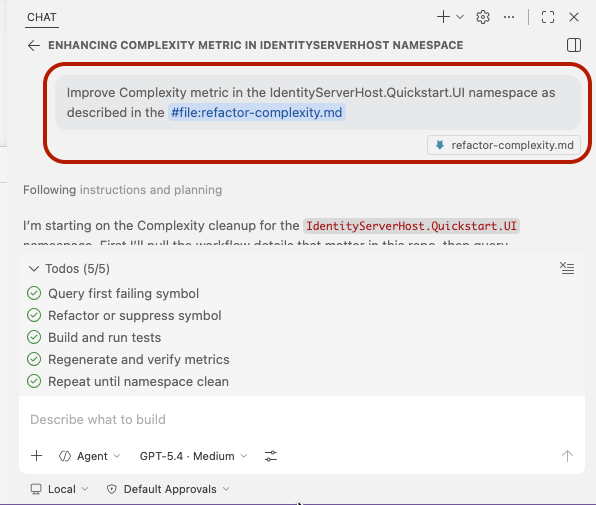
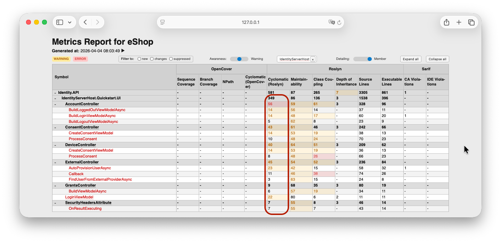
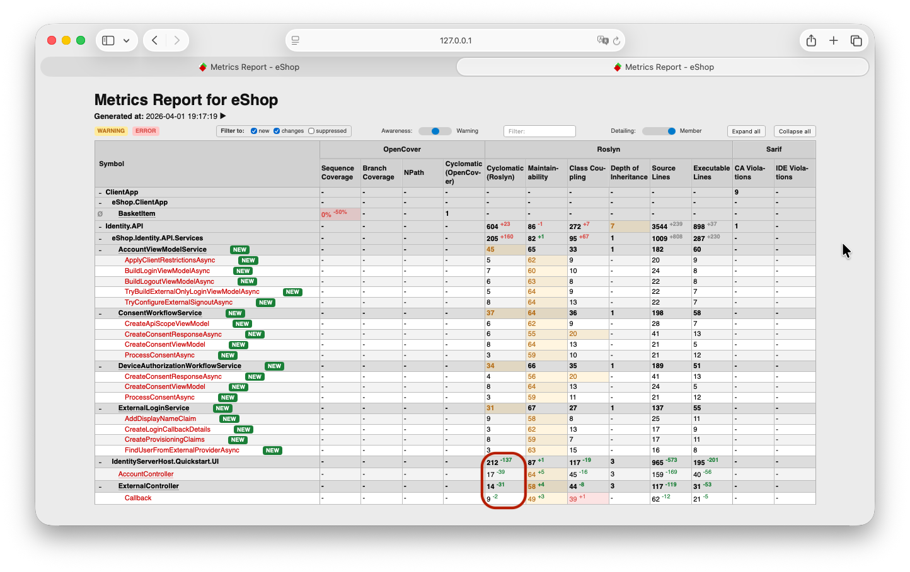

# MetricsReporter Demonstration on dotnet/eShop

This fork is intentionally used as a test and demonstration repository for MetricsReporter on a real third-party codebase: [dotnet/eShop](https://github.com/dotnet/eShop). The goal is not to redefine eShop itself, but to show what it takes to wire MetricsReporter into an existing production-style solution, generate a complete metrics baseline, and then use those signals to drive an AI-assisted refactoring workflow.

## What This Repository Demonstrates

- MetricsReporter configured against a non-trivial external repository rather than a toy sample.
- End-to-end collection of Roslyn metrics, SARIF diagnostics, OpenCover coverage artifacts, and ReportGenerator HTML output.
- A concrete AI-assisted refactoring example, driven by a prepared prompt and validated through the generated report.
- Why a consolidated report matters when one "improvement" simply redistributes complexity instead of truly reducing it.

## Validation Environment

The setup and validation work in this repository were executed in GitHub Codespaces on Ubuntu 24.04.3 LTS (Noble Numbat).

To inspect the generated HTML assets locally, a simple static server was used from the repository root:

```bash
python3 -m http.server 8001 --directory Metrics/
```

After that, the generated files were opened through localhost, for example:

- `http://127.0.0.1:8001/MetricsReport.html`
- `http://127.0.0.1:8001/ReportGenerator/`

## How The Repository Was Prepared

The full setup history is preserved in the `mr` branch. The sequence of commits is intentionally structured as a walkthrough, so the quickest way to understand the implementation details is to read the commit descriptions in that branch.


The setup is best understood as a staged pipeline: establish build and test stability first, then generate coverage, Roslyn metrics, and SARIF diagnostics, then wire those artifacts into MetricsReporter, and finally use the resulting report as the feedback loop for an AI-assisted refactoring pass. The screenshot above exists mainly to show that this was captured as a reproducible branch history rather than described only in prose.

The most demanding part was artifact orchestration rather than any single command. Roslyn metrics, SARIF logs, coverage data, and ReportGenerator output all had to be generated consistently and in locations that MetricsReporter could consume without ambiguity. In practice, that orchestration was reduced to three PowerShell scripts:

1. `Metrics/Scripts/collect-coverage.ps1` runs the repository coverage target and produces OpenCover XML, plus the aggregated ReportGenerator HTML output.
2. `Metrics/Scripts/collect-sarif-and-roslyn.ps1` performs a solution build that refreshes Roslyn XML metrics and compiler-generated SARIF diagnostics.
3. `Metrics/Scripts/refresh-report.ps1` re-aggregates the final JSON and HTML report from the already generated artifacts, without rebuilding or retesting.

The most sensitive file in that process is `.metricsreporter.json`: it binds those scripts to specific metrics, defines artifact locations, names the report outputs, configures aliases, and controls how navigation works inside the generated report. Small mistakes there can make the final report incomplete, stale, or misleading. In this repository, that file became the control plane for the whole experiment.

One especially important implementation detail from the `mr` branch is the Roslyn metrics setup on Linux. The metrics generation flow was adapted so it works in a Codespaces-based Ubuntu environment, including the handling required to execute the Roslyn metrics tooling reliably outside a Windows Visual Studio installation.

## Key Refactoring Example

The central demonstration in this repository is an AI-assisted refactoring pass focused on the `Cyclomatic Complexity` metric in the `IdentityServerHost.Quickstart.UI` namespace.

For that step, the repository includes pre-authored prompts in `Metrics/Agent`, and the refactoring request was sent to the AI agent through the VS Code chat experience using GPT-5.4 Medium Thinking.



The prompt asked the agent to improve complexity in `IdentityServerHost.Quickstart.UI` using the prepared instructions from `Metrics/Agent/refactor-complexity.md`.

## Result: Why MetricsReporter Matters

Before refactoring, the namespace showed a concentrated complexity problem, with several members clearly exceeding acceptable thresholds.



After the AI-driven change, the report shows that the original namespace complexity dropped substantially, but the work did not actually eliminate the complexity burden. Instead, the agent split logic into a new namespace and introduced additional classes and methods that also crossed the acceptable limits for the same metric.



That is the core value of MetricsReporter in this exercise: without a unified view across namespaces, members, deltas, and newly introduced symbols, it would be very difficult to see the whole outcome. A superficial review might conclude that complexity was improved because the original namespace number went down. The report makes the broader picture visible: complexity was redistributed, not fully resolved.

## Open The Generated Report

The published report is available here:

- [Metrics Report for eShop](https://baidakovil.github.io/eShop/MetricsReport.html)

The source HTML is still committed in this repository at [Metrics/MetricsReport.html](Metrics/MetricsReport.html), but the link above is the one intended for browser viewing on GitHub via GitHub Pages. When working locally in Codespaces, the localhost-based static server remains the simplest way to inspect regenerated outputs before publishing them.

# ORIGINAL ESHOP README BELOW

# eShop Reference Application - "AdventureWorks"

A reference .NET application implementing an e-commerce website using a services-based architecture using [.NET Aspire](https://learn.microsoft.com/dotnet/aspire/).


## Getting Started

This version of eShop is based on .NET 9. 

Previous eShop versions:
* [.NET 8](https://github.com/dotnet/eShop/tree/release/8.0)

### Prerequisites

- Clone the eShop repository: https://github.com/dotnet/eshop
- [Install & start Docker Desktop](https://docs.docker.com/engine/install/)

#### Windows with Visual Studio
- Install [Visual Studio 2022 version 17.10 or newer](https://visualstudio.microsoft.com/vs/).
  - Select the following workloads:
    - `ASP.NET and web development` workload.
    - `.NET Aspire SDK` component in `Individual components`.
    - Optional: `.NET Multi-platform App UI development` to run client apps

Or

- Run the following commands in a Powershell & Terminal running as `Administrator` to automatically configure your environment with the required tools to build and run this application. (Note: A restart is required and included in the script below.)

```powershell
install-Module -Name Microsoft.WinGet.Configuration -AllowPrerelease -AcceptLicense -Force
$env:Path = [System.Environment]::GetEnvironmentVariable("Path","Machine") + ";" + [System.Environment]::GetEnvironmentVariable("Path","User")
get-WinGetConfiguration -file .\.configurations\vside.dsc.yaml | Invoke-WinGetConfiguration -AcceptConfigurationAgreements
```

Or

- From Dev Home go to `Machine Configuration -> Clone repositories`. Enter the URL for this repository. In the confirmation screen look for the section `Configuration File Detected` and click `Run File`.

#### Mac, Linux, & Windows without Visual Studio
- Install the latest [.NET 9 SDK](https://dot.net/download?cid=eshop)

Or

- Run the following commands in a Powershell & Terminal running as `Administrator` to automatically configuration your environment with the required tools to build and run this application. (Note: A restart is required after running the script below.)

##### Install Visual Studio Code and related extensions
```powershell
install-Module -Name Microsoft.WinGet.Configuration -AllowPrerelease -AcceptLicense  -Force
$env:Path = [System.Environment]::GetEnvironmentVariable("Path","Machine") + ";" + [System.Environment]::GetEnvironmentVariable("Path","User")
get-WinGetConfiguration -file .\.configurations\vscode.dsc.yaml | Invoke-WinGetConfiguration -AcceptConfigurationAgreements
```

> Note: These commands may require `sudo`

- Optional: Install [Visual Studio Code with C# Dev Kit](https://code.visualstudio.com/docs/csharp/get-started)
- Optional: Install [.NET MAUI Workload](https://learn.microsoft.com/dotnet/maui/get-started/installation?tabs=visual-studio-code)

> Note: When running on Mac with Apple Silicon (M series processor), Rosetta 2 for grpc-tools. 

### Running the solution

> [!WARNING]
> Remember to ensure that Docker is started

* (Windows only) Run the application from Visual Studio:
 - Open the `eShop.Web.slnf` file in Visual Studio
 - Ensure that `eShop.AppHost.csproj` is your startup project
 - Hit Ctrl-F5 to launch Aspire

* Or run the application from your terminal:
```powershell
dotnet run --project src/eShop.AppHost/eShop.AppHost.csproj
```
then look for lines like this in the console output in order to find the URL to open the Aspire dashboard:
```sh
Login to the dashboard at: http://localhost:19888/login?t=uniquelogincodeforyou
```

> You may need to install ASP.NET Core HTTPS development certificates first, and then close all browser tabs. Learn more at https://aka.ms/aspnet/https-trust-dev-cert

### Azure Open AI

When using Azure OpenAI, inside *eShop.AppHost/appsettings.json*, add the following section:

```json
  "ConnectionStrings": {
    "OpenAi": "Endpoint=xxx;Key=xxx;"
  }
```

Replace the values with your own. Then, in the eShop.AppHost *Program.cs*, set this value to **true**

```csharp
bool useOpenAI = false;
```

Here's additional guidance on the [.NET Aspire OpenAI component](https://learn.microsoft.com/dotnet/aspire/azureai/azureai-openai-component?tabs=dotnet-cli). 

### Use Azure Developer CLI

You can use the [Azure Developer CLI](https://aka.ms/azd) to run this project on Azure with only a few commands. Follow the next instructions:

- Install the latest or update to the latest [Azure Developer CLI (azd)](https://aka.ms/azure-dev/install).
- Log in `azd` (if you haven't done it before) to your Azure account:
```sh
azd auth login
```
- Initialize `azd` from the root of the repo.
```sh
azd init
```
- During init:
  - Select `Use code in the current directory`. Azd will automatically detect the .NET Aspire project.
  - Confirm `.NET (Aspire)` and continue.
  - Select which services to expose to the Internet (exposing `webapp` is enough to test the sample).
  - Finalize the initialization by giving a name to your environment.

- Create Azure resources and deploy the sample by running:
```sh
azd up
```
Notes:
  - The operation takes a few minutes the first time it is ever run for an environment.
  - At the end of the process, `azd` will display the `url` for the webapp. Follow that link to test the sample.
  - You can run `azd up` after saving changes to the sample to re-deploy and update the sample.
  - Report any issues to [azure-dev](https://github.com/Azure/azure-dev/issues) repo.
  - [FAQ and troubleshoot](https://learn.microsoft.com/azure/developer/azure-developer-cli/troubleshoot?tabs=Browser) for azd.

## Contributing

For more information on contributing to this repo, read [the contribution documentation](./CONTRIBUTING.md) and [the Code of Conduct](CODE-OF-CONDUCT.md).

### Sample data

The sample catalog data is defined in [catalog.json](https://github.com/dotnet/eShop/blob/main/src/Catalog.API/Setup/catalog.json). Those product names, descriptions, and brand names are fictional and were generated using [GPT-35-Turbo](https://learn.microsoft.com/en-us/azure/ai-services/openai/how-to/chatgpt), and the corresponding [product images](https://github.com/dotnet/eShop/tree/main/src/Catalog.API/Pics) were generated using [DALL·E 3](https://openai.com/dall-e-3).

## eShop on Azure

For a version of this app configured for deployment on Azure, please view [the eShop on Azure](https://github.com/Azure-Samples/eShopOnAzure) repo.
